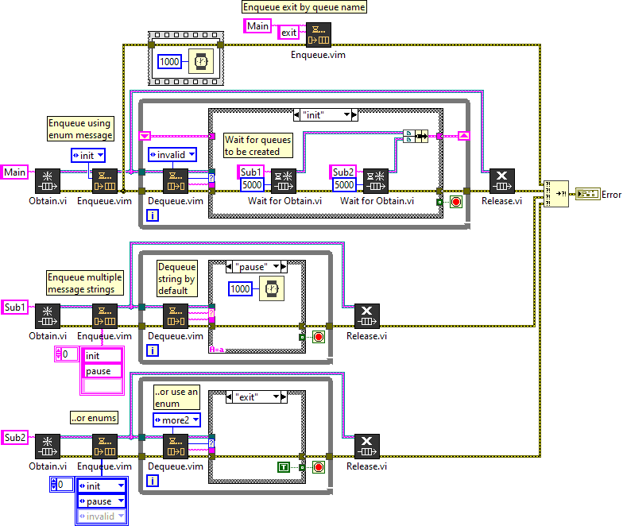
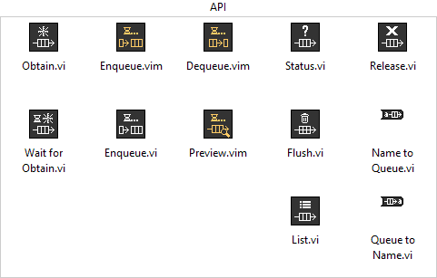

# LabVIEW Queue
 Queue library for LabVIEW

[API Reference](docs/api/queue.md)

## Getting Started

Open and run the `/src/Example.vi` to see an example on how to use this Queue library in LabVIEW.

## Overview

This Queue library is an extension to the built-in queue VIs to add malleable data type support and a better named queue caching mechanism to call/recall queues by name throughout an application (without create a new queue reference each time). 

Features:
- Obtain Named Queue Map
  - Recall Queue references by name
  - Returns the same reference (No need to Obtain + Release multiple times)
  - List all queues in memory
- `Wait to Obtain` thread synchronization 
  - Waits for a queue to be created
  - Avoids guessing when a queue is ready
- Malleable VIs for `Enqueue`, `Dequeue` & `Preview`
  - Supports one or more queues by reference or name
  - Supports enum or string message data types
- Enqueue **Method** support the following:
  - `Back` - Enqueue to back (last out)
  - `Front` - Enqueue to front (first out)
  - `Lossy` - Force enqueue to back (last out + pop front if full)
  - `Absent` - If not already enqueued (i.e. "Absent"), enqueue to back (last out)

## Functions

This Queue library is a extended wrapper of the built-in queue functions. Under the hood, the elements are converted to a flattened string queue as `<Message>,<Data>` (separated by a comma).

*Note: The `<Message>` should not contain a comma.*

### Obtain + Wait to Obtain

One common problem with multi-threaded applications is determining when a thread is ready to accept messages. In many Queued Message Handlers, references are created at the top-level application; however in Run-Time Abstracted Applications (RTAA) some threads may not be loaded.

For example, an RTAA that can launch one or more "targets" won't know at run-time how many named queues to create. In addition, the built-in Queue functions force you to either guess if the named queue is ready or always obtain the named queue (even if the thread was not created). This can cause undesired behaviour, in which a parent thread is filling a non-existant thread's queue.

Rather than using the built-in named queues, this library uses it's own functional global to avoid leftover queue refnums. If the `Obtain.vi` is called with the same Queue Name multiple times, the first to call the obtain creates the queue and the same queue reference is returned for every subsequent obtain call (rather than creating a new reference pointer each time); thus eliminating the need to release each unique queue instance.

The `Wait to Obtain.vi` solves another critical issue of multi-threaded application as to whether a thread is ready to receive messages. Unlike the built-in queue methods, this library waits for the owning thread to create the queue reference (rather than assuming the thread is ready, or force creating the queue even though the sub-thread might omitted) before sending messages.

This ensures the owning thread is the only one who should create the queue; any listeners must wait for a Named Queue to be created, escentially allowing threads to share references without passing references to each loop (Useful for synchronizing Run-Time Abstracted Applications). 

Refer to the `src/Example.vi` where the parent thread waits for the child thread to be created before enqueuing any messages.

In this example, the `Main` thread waits for the `Sub1` thread to be created; avoiding the need to pass the `Sub1` reference to the main loop (better compartmentalization/composition).

### Enqueue

The **Enqueue.vim** handles common enqueue combinations for multiple references, data types and behaviours. Enqueue supports a single or multiple Queue references or names. 

As well as enum or string message data types. Message + Data are comma delimited `<message>,<flattened_data>`, where the variant data is `Flattened to String`.

### Dequeue

The **Dequeue.vim** supports an Enum or String `Message Type` input to type case the message output. This is useful to strictly type case structures. Use the `Timeout Message` to call a specific message (and avoid nested case structures to handle the time out condition).

Use the built-in `Unflatten From String` to convert the data back to the native data type.

### Flush and Status

The `Flush` and `Status` VIs return the parsed Message + Data and accept a Queue reference or name.

### Release

Release always `Force Destroys` the queue and remove the queue reference from the cache.

*Note: Only Release a queue when the thread is finished.*

## Testing

Run the `/tests/Test_Queue.vi` to test all the Queue library VIs. If successful the `All Passed` boolean should be True.
