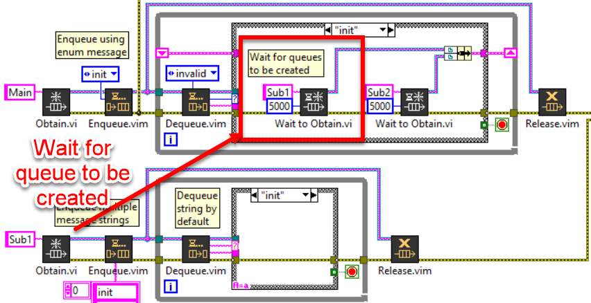
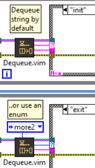

# LabVIEW Queue
 Queue library for LabVIEW

## Getting Started

Open and run the `/src/Demo.vi` to see an examples on how to use this Queue library in LabVIEW.

## Overview

This Queue library contains the malleable VI's to support multiple variations of Queues in LabVIEW. This library uses a string queue at it's core and supports the following:

Features:
- Queue Look Up Table (LUT)
  - Recall Queue references by name
  - Returns the same reference (No need to Obtain + Release)
  - Fetch queues in memory
- Thread synchronization with `Wait to Obtain`
  - Waits for a queue to be created
- Malleable VIs for `Enqueue`, `Dequeue`, `Status`, `Flush` and `Release`
  - Handles one or more queue references or names
  - Handles enum or string data types
- `Enqueue.vim` supports commonly used behaviours:
  - `Back` - Enqueue to back
  - `Front` - Enqueue to front
  - `Lossy` - Force enqueue to back (pop front)
  - `Absent` - If not already enqueued, enqueue to back

## Functions

The `Enqueue.vim`, `Flush.vim`, `Status.vim` and `Release.vim` all support a Queue reference or Queue Name as an input, making the Queue VI's more versatile for multi-threaded applications (passing reference wires everywhere not needed).

### Obtain + Wait to Obtain

One common problem with multi-threaded applications is the need to pass data between threads. Queues are useful to solve this problem but due to the nature of LabVIEW's data flow paradigm, passing references arround the application can get ugly (with non-deterministic reference collection).

Rather than using the built-in named queues, this library uses it's own functional global to avoid leftover queue refnums. If the `Obtain.vi` is called with a Queue Name, the queue reference is cached in a functional global look up table. The same Queue reference is returned each time the a named Obtain is called, thus eliminating the need to release each unique queue instance.

This Queue library also contains a `Wait to Obtain.vi` to wait for a Named Queue to be created. This escentially allows for threads to share references without passing references to each loop. Useful for synchronizing multi-threaded parent/child loop. The parent thread waits for the child thread to be created (i.e. Queue created) before enqueuing the messages.

In this example, the `Main` thread waits for the `Sub1` thread to be created; avoiding the need to pass the `Sub1` reference to the main loop (better compartmentalization).

### Enqueue

The **Enqueue.vim** handles common enqueue combinations for multiple references, data types and behaviours. Enqueue supports a single or multiple Queue references or names. 

As well as enum or string message data types. Message + Data are comma delimited `<message>,<flattened_data>`, where the variant data is `Flattened to String`.

### Dequeue

The **Dequeue.vim** supports an Enum or String `Message Type` input to type case the message output. This is useful to strictly type case structures. Use the `Timeout Message` to call a specific message (and avoid nested case structures to handle the time out condition).

Use the built-in `Unflatten From String` to convert the data back to the native data type.

### Flush and Status

The `Flush` and `Status` VIs return the parsed Message + Data and accept a Queue reference or name.

### Release

Release always `Force Destroys` the queue and remove the queue reference from the cache.

*Note: Only Release a queue when the thread is finished.*

## Testing

Run the `/tests/Test_Queue.vi` to test all the Queue library VIs. If successful the `All Passed` boolean should be True.