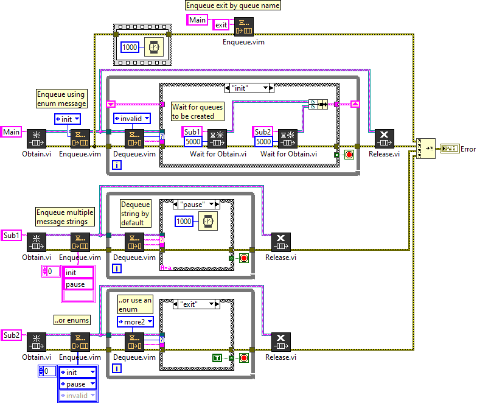
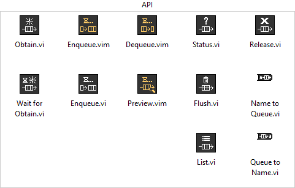

# Queue
Queue library for LabVIEW

## Examples

### Queue.lvlib : Example.vi

Open and run the `Example.vi` to see how to use this Queue library in LabVIEW.

This example demonstrates basic queue communication with a main loop and multiple sub-threads. Refer to the diagram labels for more information.

## VI Tree

The Queue library contains the following sections:
- <b>Examples</b>: Example VIs
- <b>API</b>: Top-level VIs
- <b>SubVIs</b>: Low-level VIs

**Examples**

**API**

**SubVIs**

## VI Descriptions

**API**

---

### Queue.lvlib : Dequeue.vim

Remove an element from the queue.

| Terminal | Description | Default |
| --- | --- | --- |
| Queue in | String queue reference | |
| Timeout Message | Message returned if a timeout occurs. | "" |
| Timeout in ms | Milliseconds to wait before timing out | -1=Never |
| Message Type | Malleable type for **Message** | "" |
| Queue out | String queue reference out | |
| Message | Message text before comma: `<msg>,<data>` | |
| Data | Remaining data after the comma: `<msg>,<data>` | |
| Timed Out? | Returns True if no message is returned after **Timeout in ms** | |
| Element | Raw queue element returned |

| Malleable Controls | Supported Types |
| --- | --- |
| Timeout Message | String, Enum |
| Message Type | String, Enum |
| Message | String, Enum |

### Queue.lvlib : Enqueue.vi

Add a message to the queue.

| Method | Description |
| --- | --- |
| Back | Enqueue to the back (last out) |
| Front | Enqueue to the front (first out) |
| Lossy | Force Enqueue to the back, drop front message if full |
| Absent | Enqueue to the back only if the message does not exist on the queue, otherwise do not enqueue |

### Queue.lvlib : Enqueue.vim

Add a message to the queue. This malleable VI accepts multiple queues and message data types.

| Method | Description |
| --- | --- |
| Back | Enqueue to the back (last out) |
| Front | Enqueue to the front (first out) |
| Lossy | Force Enqueue to the back, drop front message if full |
| Absent | Enqueue to the back only if the message does not exist on the queue, otherwise do not enqueue |

### Queue.lvlib : Flush.vi

Remove all elements in the queue. Returns the `<msg>,<data>` parts.

### Queue.lvlib : List.vi

List all queue names and references.

Use the **Obtain.vi** to register the named queues.

### Queue.lvlib : Obtain.vi

Obtains a string queue reference. If **Queue Name** is defined, this caches the queue reference. Named queues return the same queue reference. Unnamed queues are not cached.

See **List.vi** to get a list of queues in memory.

### Queue.lvlib : Preview.vim

Previews the next element in the queue. This malleable VI accepts a string or enum message data type.

### Queue.lvlib : Release.vi

Force release a queue reference and remove the named queue from the cache if exists. Obtaining named queues do not need to be released. The same reference is returned each time.

**Warning: Releasing a queue always force destroys the queue reference.**

### Queue.lvlib : Status.vi

Returns the status of a queue. If **Return Elements?** is True, this returns the `<msg>,<data>` element parts.

### Queue.lvlib : Wait for Obtain.vi

Wait for a named queue to be created. Rather than assuming a queue will be created, this waits for the child thread to create the queue. In multi-threaded applications, sub-threads may not be created at Run-Time, this ensures the thread that owns the queue reference is responsible for creating and destroying the queue reference. Specify the **ms Timeout** to limit the time to wait for the **Queue Name** to be obtained.

**SubVIs**

---

### Queue.lvlib : Map.vi

Named queue map used to maintain queue references in memory.

### Queue.lvlib : Name to Queue.vi

Return a queue by **Queue Name**.

Use this library's **Obtain.vi** to cache named queues.

### Queue.lvlib : Queue to Name.vi

Return the queue name given the **Queue** reference.

Use this library's **Obtain.vi** to cache named queues.

